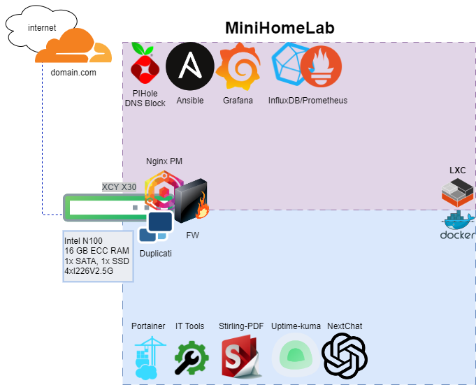
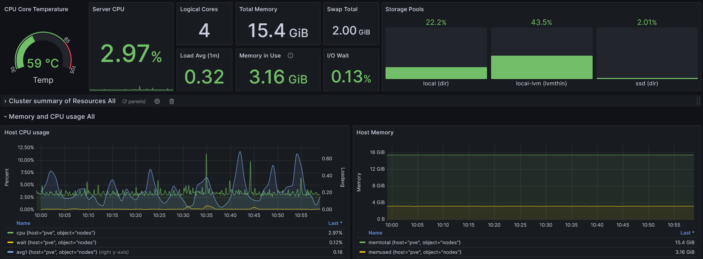

# HomeLab


## Ansible
Update Debian hosts:
```sh
ansible-playbook -i hosts /etc/ansible/upd_debian.yml
```
Install prometheus_node_exporter and alert_manager for new hosts:
```sh
ansible-playbook -i hosts /etc/ansible/grafana_stack/install_monitoring.yml
```

## Grafana

### Dashboards
* [Node Exporter Full](https://grafana.com/grafana/dashboards/1860) For VMs and LXC containers
* [Proxmox Cluster [Flux]](https://grafana.com/grafana/dashboards/15356) For Proxmox
* [Monitor PI-HOLE ](https://grafana.com/grafana/dashboards/19760-monitor-pi-hole-sparta) For Pi-Hole

## Backups
Local backup jobs by schedule + [Duplicati](https://www.duplicati.com/) encrypted backups to Google Drive

## Public domains
[Cloudflare tunnel](https://www.cloudflare.com/products/tunnel/) + [Nginx Proxy Manager](https://nginxproxymanager.com/) provides easy access to the homelab from the internet with HTTPS and strict allow policys