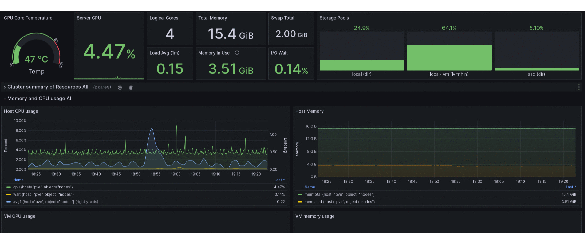
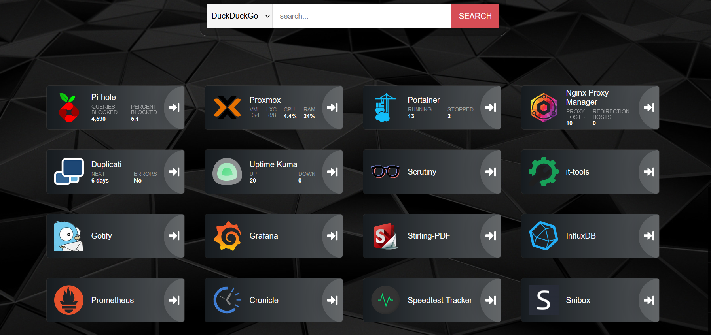

# HomeLab
Hello, everyone! This is my little home lab. This is a temporary host for my educational purposes, when I have more space I will buy more serious hardware))) and this host will become a firewall.

## Server Specs
| KEY | VALUE |
|--------|:-----------:|
| Model | XCY X30|
| CPU | Intel N100 |
| Storage 1 | 256GB |
| Storage 2 | 1TB |
| RAM | 16GB |
| Net Iface | x4 2.5Gbe |

## Running systems
- [Proxmox](https://www.proxmox.com/en/)
- [Duplicati](https://www.duplicati.com/)
- [Grafana](https://grafana.com/)
- [Pi-hole](https://pi-hole.net/)
- [Nginx Proxy Manager](https://nginxproxymanager.com/)
- [Portainer.io](https://www.portainer.io/)
- [InfluxDB](https://www.influxdata.com/)
- [Prometheus](https://prometheus.io/)
- [It-tools](https://github.com/CorentinTh/it-tools)
- [Stirling PDF](https://github.com/Stirling-Tools/Stirling-PDF)
- [Uptime-kuma](https://github.com/louislam/uptime-kuma)
- [Cronicle](https://github.com/jhuckaby/Cronicle)
- [Speedtest Tracker](https://github.com/alexjustesen/speedtest-tracker)
- [Gotify](https://gotify.net/)
- [Heimdall](https://github.com/linuxserver/Heimdall)
- [Scrutiny](https://github.com/AnalogJ/scrutiny)
- [n8n](https://n8n.io/)
- [Semaphore](https://semaphoreui.com/)
- [qBittorrent](https://www.qbittorrent.org/)
- [Paperless-ngx](https://docs.paperless-ngx.com/)

## Grafana

### Dashboards
* [Node Exporter Full](https://grafana.com/grafana/dashboards/1860) For VMs and LXC containers
* [Proxmox Cluster [Flux]](https://grafana.com/grafana/dashboards/15356) For Proxmox
* [Uptime Kuma](https://grafana.com/grafana/dashboards/18667-uptime-kuma-metrics/) For Uptime Kuma

## Backups
Local backup jobs by schedule for VM/Containers and work laptope then encrypted backups using [Duplicati](https://www.duplicati.com/) to Google Disk

## Heimdall

## Cronicle
* [Proxmox VE LXC Updater](https://raw.githubusercontent.com/tteck/Proxmox/main/misc/update-lxcs.sh)
* [Run upd Debians --limit debian](ansible/upd_debian.yml)
* [Run upd VPN --limit vpn](ansible/upd_debian.yml)
* Docker containers update
* Pi-hole update

## Scrutiny

## Gotify
Alerts from Proxmox, Cronicle, Uptime-kuma, Grafana, Diun and Scrutiny

## Public domains
[Cloudflare tunnel](https://www.cloudflare.com/products/tunnel/) + [Nginx Proxy Manager](https://nginxproxymanager.com/) provides easy access to the homelab from the internet with HTTPS and strict allow policies + [Crowdsec](https://www.crowdsec.net/) as alternative fail2ban
